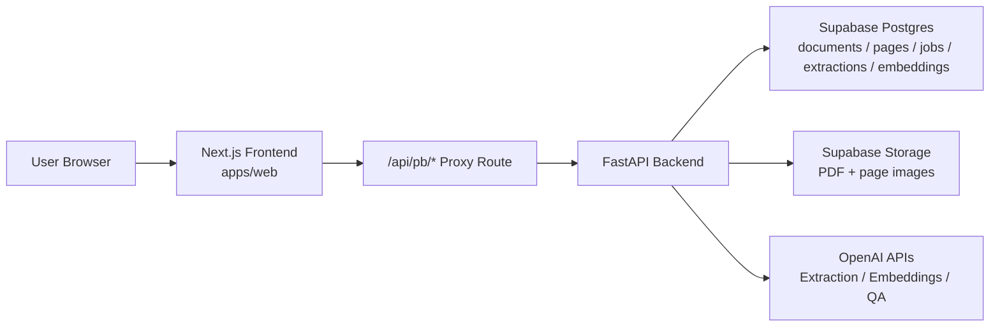
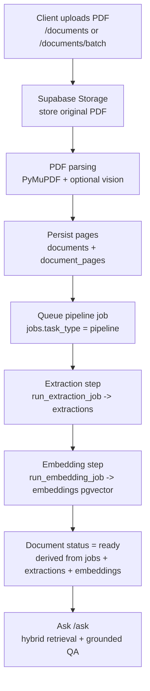

# PaperBridge

Production-ready AI document intelligence system for PDFs. PaperBridge lets you upload documents, automatically extract and embed their contents, and ask grounded natural language questions with page-level citations. The project is a full-stack monorepo with a Next.js frontend and a FastAPI backend wired to Supabase and OpenAI.

---

## Key Features

- **PDF ingestion pipeline**: Upload single or multiple PDFs, with checksum-based deduplication and synchronous page parsing into `documents` / `document_pages`.
- **Async extraction + embedding jobs**: Background pipeline (`extract → embed`) managed via the `jobs` table with idempotent skip/resume behavior.
- **RAG question answering**: `/ask` endpoint runs OpenAI embeddings + hybrid retrieval (pgvector + lexical) and returns strictly grounded answers.
- **Page-level citations**: Every answer returns citations tied to document IDs and PDF page ranges, suitable for UI highlighting.
- **Supabase-backed storage**: Original PDFs and optional rendered page images stored privately in Supabase Storage.
- **Signed document downloads**: Short-lived, signed URLs to download the original PDF via `/documents/{id}/download`.
- **Review + export**: JSON and CSV export of extractions plus a review endpoint to record human edits.

---

## Tech Stack

| Layer            | Tech & Libraries                                                                 |
|------------------|-----------------------------------------------------------------------------------|
| Frontend         | Next.js (App Router), React, TypeScript, React Query                             |
| Backend API      | FastAPI (async), Pydantic, SQLAlchemy, pgvector                                  |
| Database         | Supabase Postgres (`documents`, `document_pages`, `jobs`, `extractions`, `embeddings`) |
| Vector Search    | `pgvector` with OpenAI `text-embedding-3-small`                                  |
| Storage          | Supabase Storage private bucket (`paperbridge-documents`)                        |
| LLM / QA         | OpenAI Chat (`gpt-4o-mini`) via `openai` Python SDK, structured JSON via Instructor |
| PDF Parsing      | PyMuPDF + optional OpenAI Vision for low-text pages                              |
| Containerization | Docker, `uv` for Python dependency management                                    |
| Tooling          | `pnpm` workspace, TypeScript, ESLint, Prettier                                   |

---

## Architecture



The frontend calls only `/api/pb/*`, and the proxy route in `apps/web` forwards requests to the FastAPI backend using `NEXT_PUBLIC_API_BASE_URL`.

---

## Processing Pipeline



The pipeline runs inside the API process using background tasks and the `jobs` table, so clients can safely poll `/jobs/{job_id}` until completion.

---

## End-to-End System Flow

1. **Upload**
   - User uploads one or more PDFs from the Next.js app.
   - The browser calls `/api/pb/documents` (or `/documents/batch`), which proxies to the FastAPI backend.
2. **Ingestion**
   - Backend pushes the PDF to Supabase Storage and parses pages into `document_pages`.
   - A `pipeline` job is queued per document to orchestrate extraction and embeddings.
3. **Extraction & Embedding**
   - Extraction job calls OpenAI via Instructor to produce structured JSON into `extractions`.
   - Embedding job chunks text and writes normalized OpenAI vectors into `embeddings` (pgvector).
4. **Ask / RAG**
   - User asks a question via `/api/pb/ask`.
   - Backend embeds the question, runs hybrid retrieval, then calls OpenAI Chat to generate a grounded answer with citations.
5. **Review, Export & Download**
   - Clients can download the original PDF via `/documents/{id}/download`.
   - Latest extraction can be exported as JSON or CSV, and review edits can be submitted for auditability.

---

## Project Structure

```text
.
├─ apps/
│  └─ web/              # Next.js frontend (App Router) and /api/pb/* proxy
├─ backend/             # FastAPI backend, services, db models
│  ├─ app/
│  │  ├─ main.py        # FastAPI app + routers
│  │  ├─ routers/       # health, documents, jobs, ask, review, export
│  │  ├─ services/      # pdf_parser, extractor, embedder, pipeline, qa, supabase_storage, ...
│  │  └─ db/            # SQLAlchemy models + SQL migration script
│  └─ .env.example      # Backend env template
├─ docs/                # API, local dev, deployment docs
├─ pnpm-workspace.yaml  # pnpm monorepo definition
└─ LICENSE              # MIT
```

---

## Setup Instructions

### Prerequisites

- Node.js 20+
- `pnpm` 9+
- Python 3.12+ and `uv`
- Supabase project (Postgres + Storage bucket, e.g. `paperbridge-documents`)
- OpenAI API key

### Backend Setup

From repo root:

```bash
cd backend
cp .env.example .env
```

Then:

- Run the SQL in `backend/app/db/migrations.sql` inside your Supabase Postgres instance.
- Set the required environment variables (see below).
- Install and run the API:

```bash
cd backend
uv sync
uv run uvicorn app.main:app --reload --host 0.0.0.0 --port 8000
```

### Frontend Setup

From repo root:

```bash
pnpm -w install
```

Create `apps/web/.env.local` with:

```bash
NEXT_PUBLIC_API_BASE_URL=http://127.0.0.1:8000
```

Then start the web app:

```bash
pnpm --filter web dev
```

Open `http://localhost:3000` in your browser.

---

## Environment Variables

### Backend (`backend/.env`)

Required:

- `OPENAI_API_KEY` – OpenAI API key.
- `SUPABASE_URL` – Supabase project URL.
- `SUPABASE_SERVICE_ROLE_KEY` – Supabase service role key (used server-side only).
- `SUPABASE_STORAGE_BUCKET` – Storage bucket name (default: `paperbridge-documents`).
- `DATABASE_URL` – Postgres URL (Supabase connection string).

Core configuration (pre-populated in `.env.example`):

- `CHAT_MODEL` – e.g. `gpt-4o-mini`.
- `OPENAI_EMBED_MODEL` – e.g. `text-embedding-3-small`.
- `OPENAI_EMBED_DIMS` – embedding dimension (e.g. `1536`).
- `MAX_UPLOAD_MB`, `MAX_PAGES` – upload and parsing limits.
- `ASK_RATE_LIMIT_PER_MINUTE`, `UPLOAD_RATE_LIMIT_PER_MINUTE` – rate limiting.
- `RAG_TOP_K`, `RAG_VECTOR_CANDIDATES`, `RAG_LEXICAL_WEIGHT`, `RAG_CONTEXT_MAX_TOKENS` – retrieval tuning.

### Frontend (`apps/web/.env.local`)

- `NEXT_PUBLIC_API_BASE_URL` – Base URL for the FastAPI backend. All browser calls hit `/api/pb/*`, which proxies to this origin.

---

## Running Locally

1. **Start backend**
   - Configure `backend/.env` and run:
     ```bash
     cd backend
     uv sync
     uv run uvicorn app.main:app --reload --host 0.0.0.0 --port 8000
     ```
2. **Start frontend**
   - From repo root:
     ```bash
     pnpm -w install
     pnpm --filter web dev
     ```
3. **Smoke test end-to-end (optional)**
   - From `backend`:
     ```bash
     cd backend
     uv run python ../scripts/smoke_pipeline.py --file /absolute/path/to/sample.pdf
     ```
   - Then:
     ```bash
     curl -s -X POST http://127.0.0.1:8000/ask \
       -H 'content-type: application/json' \
       -d '{"question":"Summarize the main finding in one sentence."}' | jq
     ```

---

## API Overview

Backend base URL (local): `http://127.0.0.1:8000`

| Endpoint                                | Method  | Description                                                   |
|-----------------------------------------|---------|---------------------------------------------------------------|
| `/health`                               | GET     | Health check.                                                 |
| `/documents`                            | POST    | Upload a single PDF, parse, and queue pipeline job.          |
| `/documents/batch`                      | POST    | Upload multiple PDFs and queue pipeline jobs.                |
| `/documents`                            | GET     | List documents with derived status (`uploaded/processing/...`). |
| `/documents/{document_id}`              | GET     | Get a single document and its status.                        |
| `/documents/{document_id}`              | DELETE  | Delete document + pages + jobs + extractions + embeddings.   |
| `/documents/{document_id}/download`     | GET     | Get short-lived signed URL for original PDF download.        |
| `/documents/{document_id}/export.json`  | GET     | Export latest extraction as JSON.                            |
| `/documents/{document_id}/export.csv`   | GET     | Export latest extraction as CSV.                             |
| `/jobs/{job_id}`                        | GET     | Poll job status (`extract`, `embed`, `pipeline`).            |
| `/ask`                                  | POST    | Ask question across all or selected documents with citations. |
| `/extractions/{extraction_id}/review`   | POST    | Record a review edit for an extraction.                      |

See `docs/API.md` for more detailed examples.

---

## Example Usage

### Health

```bash
curl -s http://127.0.0.1:8000/health | jq
```

### Upload a PDF

```bash
curl -s -F "file=@/absolute/path/to/sample.pdf" \
  "http://127.0.0.1:8000/documents" | jq
```

Response fields include the `document_id` and a `pipeline_job_id` you can poll via `/jobs/{job_id}`.

### Ask a Question (Global)

```bash
curl -s -X POST http://127.0.0.1:8000/ask \
  -H 'content-type: application/json' \
  -d '{"question":"What does OVG stand for?"}' | jq
```

### Ask Scoped to Specific Documents

```bash
curl -s -X POST http://127.0.0.1:8000/ask \
  -H 'content-type: application/json' \
  -d '{"question":"Summarize section 2","doc_ids":["<document_id>"]}' | jq
```

### Download Original PDF

```bash
curl -s "http://127.0.0.1:8000/documents/<document_id>/download" | jq
```

Returns a JSON payload with a short-lived signed URL and filename.

---

## RAG and Citation Behavior

- **Chunking & embeddings**
  - Pages are chunked using token-aware settings (`CHUNK_SIZE_TOKENS`, `CHUNK_OVERLAP_TOKENS`).
  - Embeddings are generated with OpenAI (`OPENAI_EMBED_MODEL`) and stored as normalized vectors in `embeddings.embedding` (pgvector).
- **Hybrid retrieval**
  - `/ask` embeds the question and calls `retrieve_chunks`, which uses both vector similarity and lexical scoring.
  - Retrieval behavior is tuned by `RAG_TOP_K`, `RAG_VECTOR_CANDIDATES`, and `RAG_LEXICAL_WEIGHT`.
- **Grounded QA**
  - `qa.answer_question` constructs a `<chunk>`-wrapped context and calls OpenAI Chat with a strict JSON schema.
  - The model must answer **only** from provided chunks; if the answer is not explicitly present, it returns `"Not found in the provided documents."`.
- **Citations**
  - Citations are built from selected chunks and include `document_id`, `pdf_page_start`, `pdf_page_end`, and the supporting text.
  - Frontend can render citations as page-level highlights and link back to the source pages.

---

## Troubleshooting

- **Upload rate limit exceeded**
  - Lower upload frequency or raise `UPLOAD_RATE_LIMIT_PER_MINUTE` in backend env.
- **Failed to parse PDF document**
  - Ensure the file is a valid PDF and below `MAX_UPLOAD_MB` and `MAX_PAGES`.
- **Unable to reach backend API from proxy route**
  - Check `NEXT_PUBLIC_API_BASE_URL` and that the backend `/health` endpoint is reachable.
- **Embedding dimension mismatch**
  - Keep `OPENAI_EMBED_MODEL` and `OPENAI_EMBED_DIMS` in sync with the actual OpenAI model.
- **Jobs stuck in `queued` or `processing`**
  - Confirm the backend process is running; background jobs execute inside the API process using `run_pipeline_job`.

---

## License

This project is licensed under the MIT License. See `LICENSE` for details.

